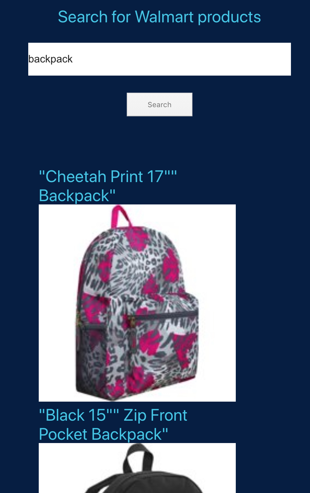

# Walmart Challenge!
### What is the challenge?
1. Given a list of product Id's, produce a REST API to search keywords on product descriptions.
2. Get information on products from the Walmart Product API.
3. Don't make parallel requests to the api due to rate limiting

### Run it

To run the API:
```bash
cd wlabs-search-service; npm install; npm run start-watch;
```

To run the UI:
```bash
cd wlabs-pwa; npm install; npm run start;
```

### Solution
##### The Search API Service
The API is a simple hapi server with one route available

GET /search?query=backpack

Returns JSON:
```javascript
{
  [
    { itemId: 35613901, shortDescription: 'some string', mediumImage: 'url', ...}
  ]
}
```

Querying requires searching on product meta data. This means that the API needs
to have access to the meta data objects being indexed. Pulling down meta data
from the list of products and indexing it.

This list is guaranteed to be up to date because of our cache sync mechanism.
Which is simply polling the api every 5 minutes for new data.

The API is protected from rate limiting because of the request queuing in our
search service. To prevent reaching the request limit on the service we batch
our requests into 20 items per request and then make the batch calls in serial.

Searching uses a fuzzy text matcher from the Fuse.js library. This allows the
tuning of fuzzyness in the matching and will hopefully find better results than
just a indexOf kind of match.

The items to be searched on are stored in an array in `con/config.js`.

##### The UI

The API is published with a UI written in a simple react Progressive Web
Application (PWA). Used create-react-app --typescript to create a simple PWA
with typescript. The PWA makes a call to our service running on port 3002 and
displays the results.
<br />

